# _**Watson Assistant Lab 1**_: Cognitive Chatbot Basics
In this lab we'll start to build a chatbot using _**Watson Assistant**_. This basic chatbot will recommend a new mobile phone for a user based on their feedback about previous experiences with phones.

## Requirements
- [IBM Cloud account](https://cloud.ibm.com/)

## Agenda
- Introduction to [Watson Assistant](https://www.ibm.com/cloud/watson-assistant/)
- Setup the **_Watson Assistant_** service
- Understanding user intent: create **_intents_** and _**entities**_
- Building chatbot responses: create a _**dialog tree**_
- Test your chatbot
- Adding rich content: sending images

## Introduction to Watson Assistant
IBM **_Watson Assistant_** allows you to create cognitive chatbots that you can customise for your business, and deploy them across multiple channels to bring help to your customers where and when they need it.

Most chatbots try to mimic human interactions, which can frustrate users when a misunderstanding arises. Watson Assistant is more. It knows when to search for an answer from a knowledge base, when to ask for clarity, and when to direct you to a human.

Anyone can build chatbots with **_Watson Assistant_** - it comes pre-trained with industry-relevant content, can make sense of your historical chat or call logs, and has a visual dialog editor. Industry-leading AI powers the underlying natural language models that understand your users and provides training recommendations as you build and run your chatbot. And you have the flexibility to deploy **_Watson Assistant_** within your own site, in a mobile app, and via many messaging channels and customer service tools.

## Setup the Watson Assistant service
In this section we are going to create a **_Watson Assistant_** instance on IBM Cloud, and use it to build a basic chatbot that answers queries about mobile phones.

**(1)** Log into IBM Cloud and create a **_Watson Assistant_** service.
- Click on `Catalog`, then filter by clicking on `AI`
- Select `Watson Assistant`

  

**(2)** Create the service with a unique name: we'd suggest something like `Watson Assistant-eventname-yourinitials`, e.g. `Watson Assistant-DSA-GRW`

Scroll down and ensure you are using the `Lite` plan, then hit `Create`.

**(3)** Click on `Launch Watson Assistant`.

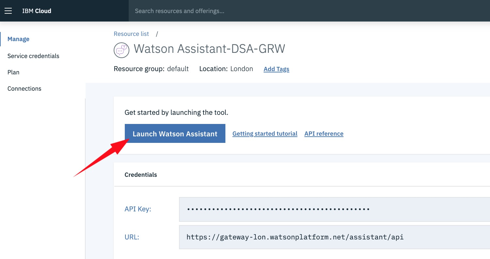

## Understanding user intent: create _**intents**_ and _**entities**_
**(1)** The first thing we need to do in **_Watson Assistant_** is create a _**Skill**_. A _**skill**_ contains the training data and machine learning logic that enables your chatbot to understand and help users and customers.

Click on `Skills` in the menu bar, then `Create Skill`. Enter the name `Phone Advisor` for your skill, and hit `Create dialog skill`:

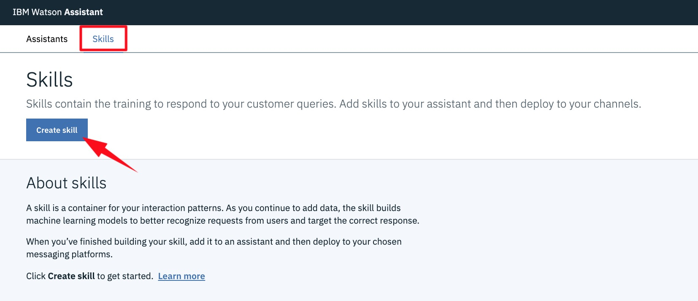

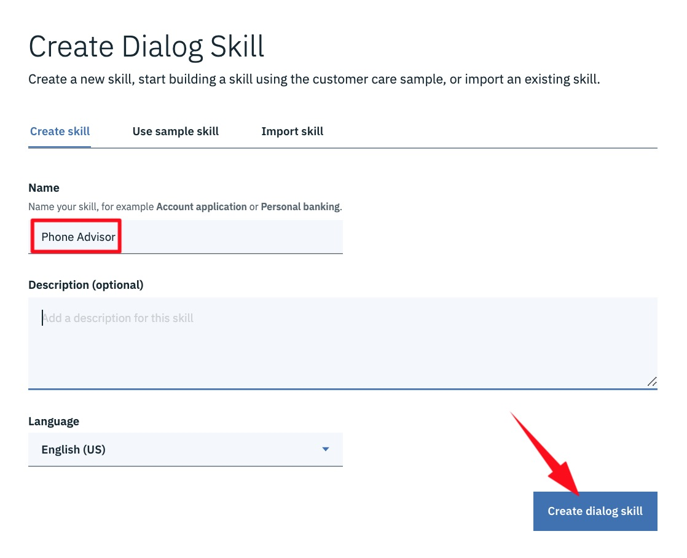

Now we'll go on to create the constructs required for our chatbot: _**Intents**_, _**Entities**_ and _**Dialogs**_.

**(2)** Create the chatbot _**Intents**_.

An _**intent**_ represents the **purpose** of a user's input. By recognising the intent expressed by a user, _**Watson Assistant**_ can choose the correct dialog flow to use to respond to it. To plan the _intents_ for your application, you need to consider what your chatbot users might want to do, and what you want your application to be able to handle.

Choosing the correct _intent_ for a user's input is the first step in providing a useful response. The _intents_ you identify for your application will determine the dialog flows you need to create; they also might determine which back-end systems your application needs to integrate with in order to complete customer requests (such as customer databases or payment-processing systems).

Select `Create Intent` to get started, and create an _intent_ name of `greeting`. You can add a description for your _intent_ here if you wish.

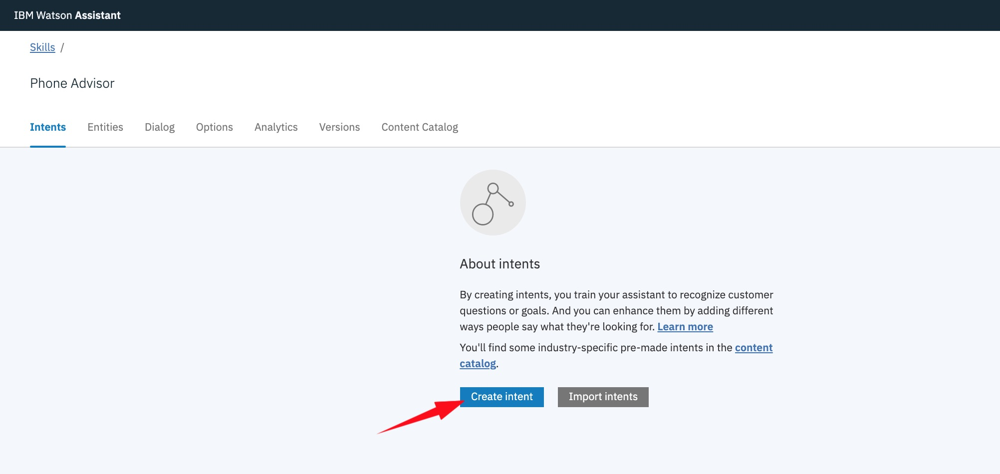

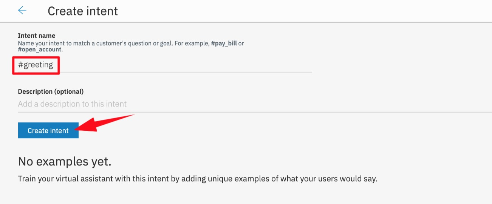

**(3)** Once you've hit `Create Intent`, you need to add multiple **user examples** of how a user might greet your bot, e.g.:
- `hi`
- `hello`
- `good morning`
- `good afternoon`
- `good evening`

Feel free to add a few more variations of your own.

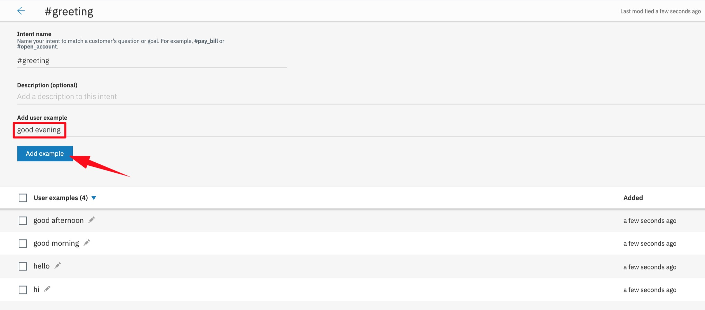

**(4)** When you've done, click on the arrow at the top left of the screen to go back, then hit `Create intent` to repeat the process for our next _intent_ named `positive`:

- **Intent name:** `positive`
- **Description:** `Expressing positive opinion about mobile phones`
- **User examples:**
  - `Style is important to me`
  - `I care about looks`
  - `I like Galaxy phones`
  - `I love Apple`
  - `I need good battery life`
  - `I prefer Google`
  - `I want a good looking phone`
  - `I want a great battery`
  - `The new Samsung looks great`

What we are doing here is providing _**Watson Assistant**_ with examples of _what a user might say_ when they are expressing a positive opinion about a particular phone brand, or the key attribute they are looking for in a phone. As with any machine learning or cognitive service, the more examples you provide - _a larger training set_ - the more accurate your chatbot will be in identifying user intent.

Your `positive` _intent_ should look something like this:

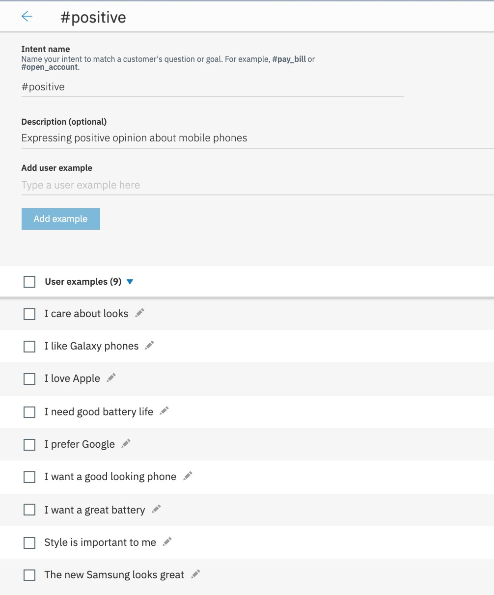

**(5)** Repeat this process twice more for the following _intents_:

- **Intent name:** `negative`
- **Description:** `Expressing negative opinion about mobile phones`
- **User examples:**
  - `Google sucks`
  - `Apple is the worst`
  - `I don't care about style`
  - `I'm not bothered about battery life`
  - `Not concerned with looks`
  - `I do not like iPhones`
  - `I hate Samsung`

- **Intent name:** `newphone`
- **Description:** `Expressing intent to buy or get advice about buying a new phone`
- **User examples:**
  - `I am interested in buying a new phone`
  - `I'm looking for a new phone`
  - `I need a new phone`
  - `I want advice regarding phones`
  - `I'd like to replace my phone`
  - `Can you recommend a phone`
  - `What's the best phone available`

Once you've created these, your _Intents_ screen should look something like this:

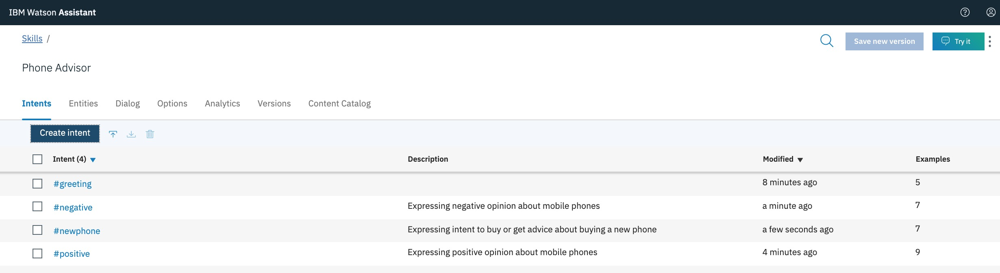

**(6)** Now let's create some **_Entities_**.

An _**entity**_ represents a term or object in the user's input that provides **context** for a particular _intent_. If _intents_ represent _verbs_ (something a user wants to do), _entities_ represent _nouns_ (such as the object of, or the context for, an action).

_Entities_ make it possible for a single _intent_ to represent multiple specific actions. For example in our case, the `positive` _intent_ can be used with _entities_ to recognise positive feeling about _different_ mobile phones or their attributes. So in effect, an _entity_ defines _a class of objects_, with specific values representing the possible objects in that class.

Select `Entities` from the menu bar, then `Create Entity`. Next enter an _entity_ name of `brand` and hit `Create Entity`.

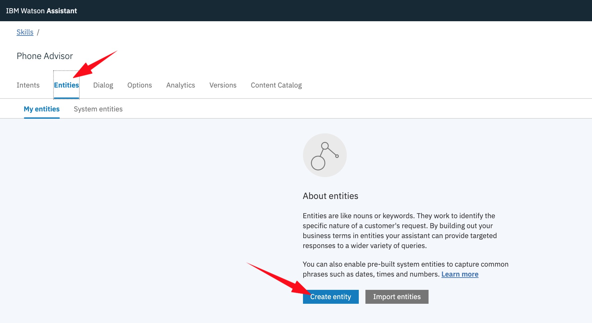

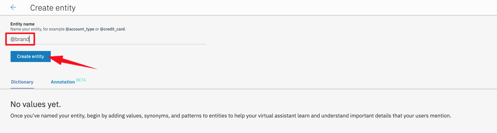

**(7)** Enter a value name of `Apple`, and then select `Show recommendations`:

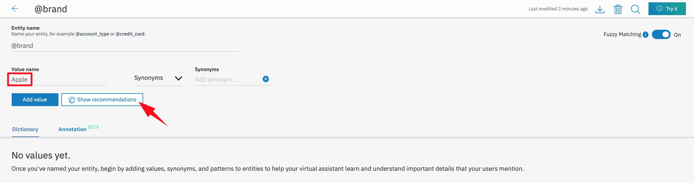

_**Watson Assistant**_ can also recommend _**synonyms**_ for your _**entity**_ values. The recommender finds related _synonyms_ based on contextual similarity extracted from a vast body of existing information, and uses natural language processing techniques to identify words similar to the existing _synonyms_ in your _entity_ value.

As you might expect, _synonyms_ allow us to use multiple values to represent a single value. In this case, we will translate the use of either _Apple_ or _iPhone_ to a `@brand` value of `Apple`, so select `iphone` from the list presented, and then hit `Add selected`.

Now select `Add value` to add _Apple_ to your `@brand` entity.

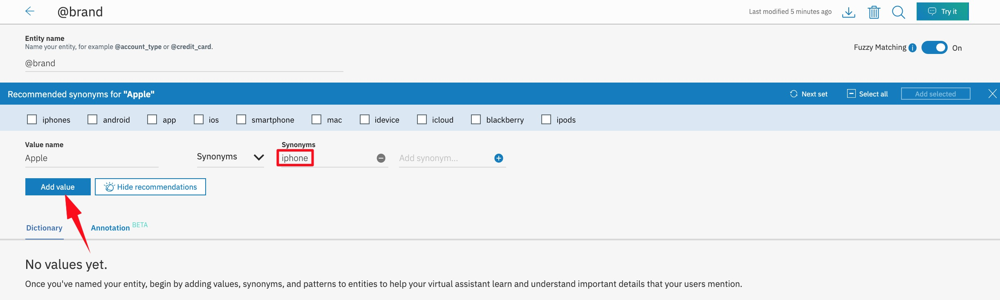

**(8)** Repeat the process for these values:

- `Google` (with _synonym_ `pixel`)
- `Samsung` (with _synonyms_ `galaxy`, `j3`, `a8` and `edge`)

Note that you can add your own _synonyms_ too. You'll need to do this when adding the _Samsung_ and _Google_ values and their _synonyms_ to your `@brand` entity, like so:

Feel free to include more phone brands here if you like. When you've finished it should look something like this:

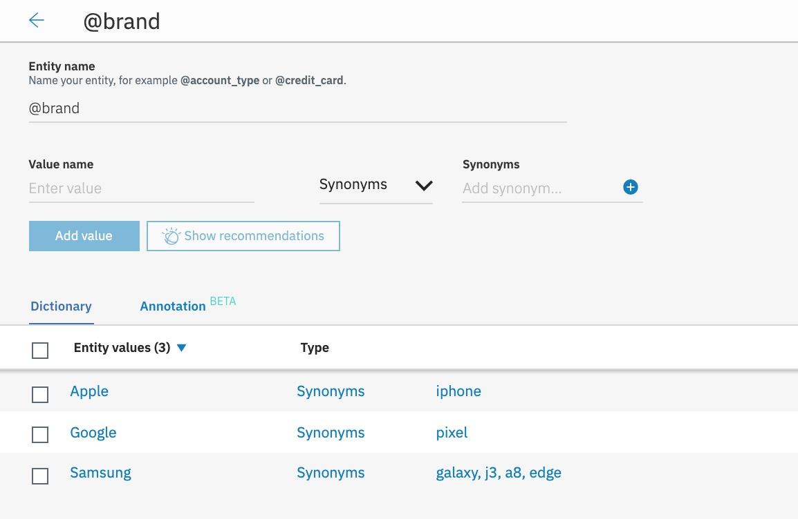

**(9)** You can also use _**pattern matching**_ when creating _entity_ values. This is really helpful if you want to pick up _entities_ that have specific formats, e.g. phone numbers or website addresses.

Take a look at the [Watson Assistant documentation](https://cloud.ibm.com/docs/services/assistant/entities.html#creating-entities) if you want to know more.

**(10)** Create another _entity_, named `attribute`, with these values:
 - `battery` (with _synonym_ `battery life`)
 - `style` (with _synonyms_ `looks`, `stylish`, `fashion`)

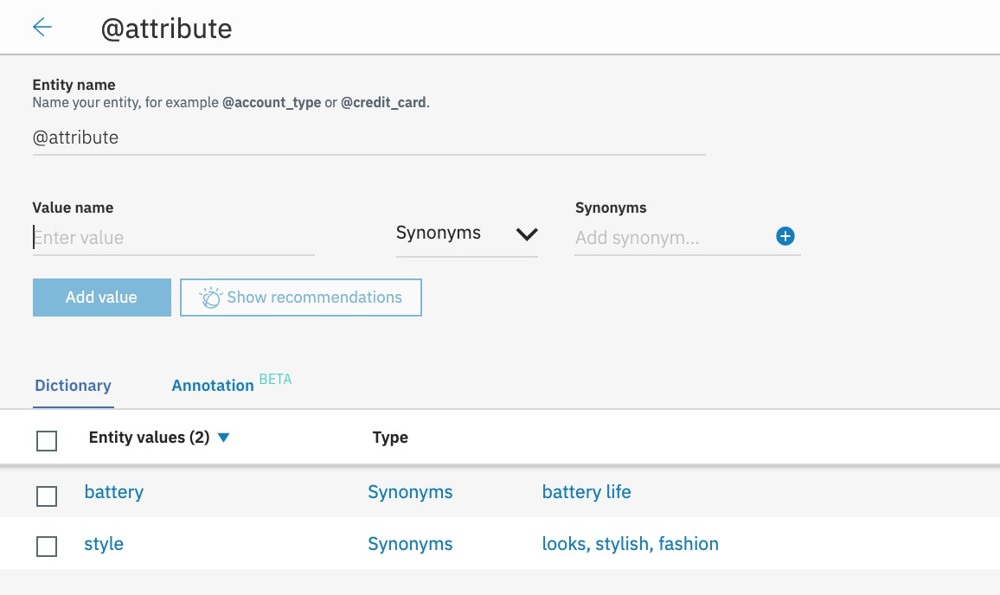

## Building chatbot responses: create a _**dialog tree**_
**(1)** The next step is to create a _**dialog**_ tree.

A _**dialog**_ uses the _intents_ and _entities_ that are identified in the user's input, plus _context_ from the application that uses _**Watson Assistant**_, to interact with the user and ultimately provide a useful response. Our _dialog_ tree should help the user choose a new mobile phone based on an existing preference or a characteristic important to the user.

**(2)** Select `Dialog` from the menu bar, and then hit `Create dialog`.

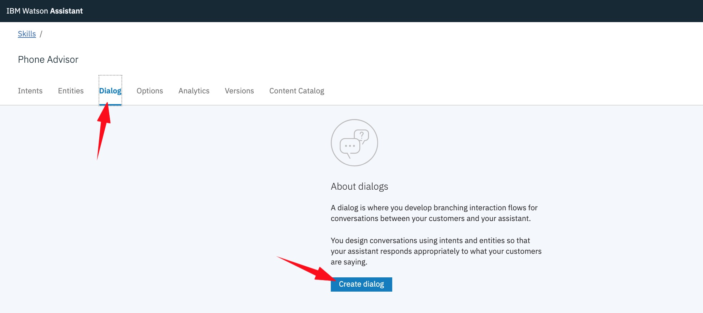

**(3)** `Welcome` and `Anything else` nodes will be automatically generated for you. The former is used to initialise the dialog with the user, and the latter catches any user input that we don't provide a specific response for within our chatbot.

Modify the `Welcome` node so it welcomes the user with the message `Hello. I am a mobile phone advisor. How can I help you?` by selecting the node, then changing the **Then Respond With** field.

Now hit the plus sign next to `welcome`, change the operator from `and` to `or`, and add the `#greeting` _intent_ to **If assistant recognizes:**

These tests ensure that we will always provide a welcome response when the dialog first starts, or when someone 'greets' the chatbot.

You can leave the `Anything Else` node with its default settings.

**(4)** Next, create a _Help_ node by selecting `Add Node`. Name it `Help`, and set the response to `Can I help you with something else?`. We'll use this node to ask the user if they want to ask us another question, after we've satisfied a previous query.

**(5)** Now we'll construct a `New Phone` node, which will pick up the user's _intent_ to ask for help with a new phone recommendation. We'll then ask the user what they are looking for in a new phone, and then look for positive or negative responses based on our previously built _intents_, as well as picking up either a brand name or a phone attribute defined by our _entities_.  Our recommendation response will then differ, and be dependent on the user's feedback.

Start by adding a new node `New Phone`, which is invoked if the `#newphone` _intent_ is recognised. Add a couple of responses confirming that the chatbot understands in the **Then Respond With** field:
- `I understand you want to choose a new phone.`
- `So you'd like some help choosing a new phone.`

Now click `Set to random`. This will randomly present one of these two responses to the user when we pick up the `#newphone` intent, adding a bit of variety.

**(6)** Next add a _**child node**_ to your `New Phone` node. You can do this by selecting the `New phone` node and choosing the `Add Child Node` option at the top of the dialog tree, or by selecting the three dots on the `New phone` node and then `Add Child Node` from the popup menu.

Call this child node `Ask User Preference`, ensure it is called **If assistant recognizes** `true`, and enter these two responses:
- `What's your current phone like? Does it have features you like or dislike?`
- `Tell something good or bad about your current phone, or what particular attributes you like in a phone.`

Using `true` in this way ensures we will **always** execute the logic in a node (i.e. we're not going to test for any conditions). In this case it means we'll send one of these two responses whenever we reach this point in the dialog.

This node is asking the user what they like/dislike about their phone. We'll add some more logic to this soon, but in order to drop into this child node directly from the `New Phone` node (i.e. without waiting for a further user response), we need to instruct the `New Phone` node to not wait for any user input.

Select the `New phone` node and change the **And finally** option to `Skip User Input`.

**(7)** Finally, we need to create **four** child nodes of the `Ask User Preference` node that will ultimately decide the chatbot's response to the user's input. When completed it will look like this:

**(8)** The `Brand Positive` node should recognise a `#positive` _intent_ together with a `@brand` _entity_ - essentially looking for positive feelings about a brand - and then respond with a recommendation.

Add a child node to the `Ask User Preference` node. When you edit this _and each of the other child nodes you are about to add here_, you should ensure that you allow for **multiple responses** by first selecting `Customize` from the top right, ensure `Multiple responses` is set to `On`, then hit `Apply`.

Now name the node `Brand Positive`, and ensure it's called **If assistant recognizes** both a `#positive` _intent_ **and** a `@brand` _entity_. Then configure the responses like this:

If assistant recognizes  |  Respond with
--|--
`@brand:Apple`  |  `If you like Apple you could get the iPhone XR.  It's pretty cool.`
`@brand:Google`  |  `A Google fan, huh?  I'd probably go for the Pixel 3.`
`@brand:Samsung`  |  `If you like Samsung I'd recommend a new Galaxy S9.`

After we've provided a response to the user, we want to make sure we ask them if they need any more help. Edit the **And finally** section so that we `Jump to` to our `Help` node. Choose `Respond` after you've selected `Help` as the destination node for the jump:

**(9)** Now create the `Brand Negative` child node. It should look pretty much like `Brand Positive`, except it will test for a `#negative` _intent_ and a `@brand` _entity_. You can create this node from scratch as before, or you can `Duplicate` the `Brand Positive` node and customise it as described here.

Use responses like these if you get negative sentiment about a brand:

If assistant recognizes  |  Respond with
--|--
`@brand:Apple`  |  `If you don't like Apple you could go for an Android phone, maybe a Samsung Galaxy S9 or Google Pixel 3.`
`@brand:Google`  |  `If you don't like Google but want to stay with Android, try a Samsung Galaxy S9, or if you fancy a change, maybe a new iPhone XR?`
`@brand:Samsung`  |  `If you want to steer away from Samsung but stay with Android then you could try a Google Pixel 3, or for a change you could go for a new iPhone XR.`

**(10)** For the `Attribute Positive` child node look for `#positive` _intent_ and an `@attribute` _entity_, using responses similar to these:

If assistant recognizes  |  Respond with
--|--
`@attribute:battery`  |  `If you need a long battery life then go retro! There's an updated Nokia 3310 out now.`
`@attribute:style`  |  `Beauty is in the eye of the beholder... but the Huawei P20 Pro looks very cool.`

Don't forget to `Jump to` to your `Help` node again for both of the `Brand Negative` and `Attribute Positive` child nodes!

**(11)** The final child node should be a catch-all for any user input we don't understand in this dialog branch. It should test for `anything_else`, and respond with `I'm not sure I understand.`

This time, because we know the user **is** interested in a phone recommendation but _we couldn't classify their feedback_ regarding their existing phone, instead of jumping to the `Help` node, we should ask the user to try providing feedback again. We do this by setting **And finally** to `Jump to` the `Ask User Preference` node and `Respond`.

## Test your chatbot
**(1)** You can test your _dialog_ inside the _**Watson Assistant**_ application. Select the `Try It` button at the top right of the screen to enter the _dialog_ tester:

**(2)** Try and test all of your _dialog_ branches. It'll look something like this:

See how _**Watson Assistant**_ is picking out the _intents_ and _entities_ it sees in the user input, and responds accordingly.

**(3)** If you enter something _**Watson Assistant**_ _doesn't_ recognise - or if it's interpreting it incorrectly - you have the chance to further **train** Watson. In the example below I've entered `My Galaxy is very average`. _**Watson Assistant**_ is currently seeing this as _positive_, when in reality it's probably a fairly _negative_ statement.

At this point, as I understand that saying something is _'very average'_ is probably indicative of a negative user intent, we can select `#negative` from the drop down menu:

When we do this, Watson retrains our skill by adding this text as another example to our `#negative` _intent_. After training is complete, a similar user response will now work! If you check your `#negative` _intent_ you'll also see that the new example has been added to it.

## Adding rich content: sending images
You can return responses with multimedia or interactive elements such as _**images**_ or clickable _**option**_ buttons to simplify interaction within your chatbot and enhance the user experience.

In addition to the default response type of _**Text**_, for which you specify the text to return to the user as a response, the following response types are also supported:

_**Image**_: Embeds an image into the response. The source image file must be hosted somewhere and have a URL that you can use to reference it. It cannot be a file that is stored in a directory that is not publicly accessible.

_**Option**_: Adds a _list_ of one or more options. When a user clicks one of the options, an associated user input value is sent to the service. We'll add some _options_ to our chatbot later.

_**Pause**_: Forces the application to _wait_ for a specified number of milliseconds before continuing with processing. You might use this response type if you need to perform an action that might take some time, for example, if a parent node makes an external API call that takes a few seconds to respond.

Let's add some images to our existing responses.

**(1)** Select the `Brand Positive` dialog node, and then the `Edit Response` icon for the `@brand:Apple` response.

**(2)** Select `Add response type` and then `Image` from the drop-down menu.

**(3)** Enter `iPhone XR` as the **Title**, use `https://bit.ly/2o9LfQY` as the **Image source**, and hit `Save`. If you enter this URL into a web browser you should see an image of an _iPhone XR_. You can use any image URL you like here of course - try searching Google Images if you want to use your own.

**(4)** Test this out by using the `Try It` tool again. When the user says they are an Apple fan, they now also get an image of the recommended device:

**(5)** Complete the `New Phone` dialog by adding images to **all** responses. You can find your own images to add to your skill, or use the ones listed below.

For the `Brand Positive` node:

Brand   | Title     | Image source
--------|-----------|-----------------------
Apple   | `iPhone XR` | `https://bit.ly/2o9LfQY`
Google  | `Pixel 3`   | `https://bit.ly/2EhAuC1`
Samsung | `Galaxy S9` | `https://bit.ly/2zWQlmH`

**(6)** For the `Brand Negative` node, ensure you display **both** of the options we are suggesting in our text response to the user, using the same **Title** and **Image source** values as above. As an example, the `@brand:Apple` response should look like this:

**(7)** For the `Attribute Positive` node, use these values:

Attribute | Title            | Image source
----------|------------------|-------------------------
Battery   | `Nokia 3310 `    | `https://bit.ly/2RX48kj`
Style     | `Huawei P20 Pro` | `https://bit.ly/2BdHME0`

**(8)** Test out your _dialog_ again using the `Try It` button. Here's how it should look:

## Summary
Well done! You've created your first basic chatbot that understands user _intent_, can pick out _entities_, and responds differently depending on user feedback, using both text and images. The next lab will show you how to actually get your chatbot in front of your users, using multiple _**integration**_ points.

If you need to you can download the Watson Assistant skill we've created so far from [here](./assistant/skill-Phone-Advisor-lab-1.json).

There's an `Import Skill` option available whenever you create a new skill - it will be useful when you are backing up, exchanging skills, etc.:

  

Now go to [Lab 2: Chatbot Integrations](../2-Integrations) to get your chatbot working in a live environment.
