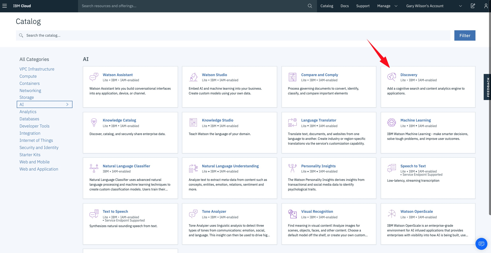
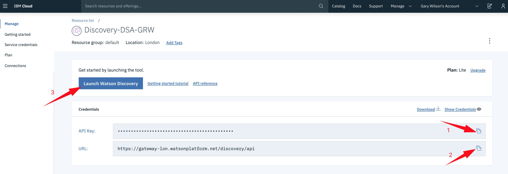
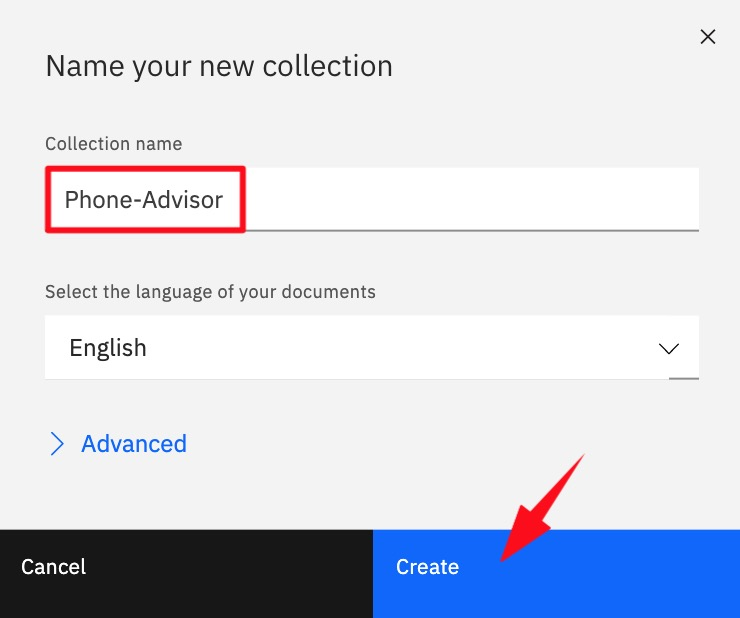
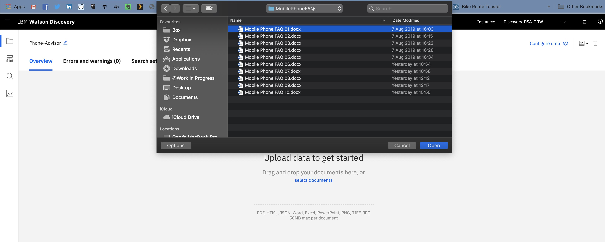
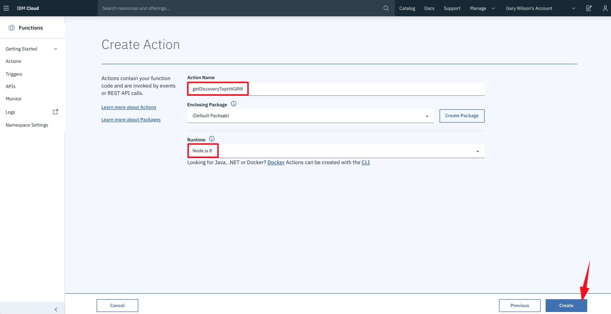

# _**Watson Assistant Lab 5**_: Extending Your Chatbot with Watson Discovery
This lab will focus on extending your simple chatbot to handle _long-tail_ conversations, by using the _**Watson Discovery**_ service.

## Requirements
- Successful completion of [Lab 4: Understanding User Sentiment - Integrating Watson Natural Language Understanding](../4-Sentiment).

## Agenda:
- Introduction to _**Watson Discovery**_
- Setup the _Discovery_ service
- Build a _Discovery_ document _**collection**_
- Query the collection using _**Watson Discovery Query Builder**_
- Create a _**Watson Discovery**_ _**IBM Cloud Function**_
- Integrate _**Watson Discovery**_ with _**Watson Assistant**_

## Introduction to _**Watson Discovery**_
IBM _**Watson Discovery**_ makes it possible to rapidly build cognitive applications that unlock actionable insights hidden in **unstructured** data — including your own proprietary data, as well as public and third-party information.

With _**Watson Discovery**_, it only takes a few steps to _prepare_ your unstructured data, create a _query_ that will pinpoint the information you need, and then _integrate_ those insights into your new application or existing solution. _Discovery_ facilitates all this by:

- automatically _crawling, converting, enriching and normalising_ your data
- _applying additional enrichments_ such as concepts, relations, and sentiment through Natural Language Understanding (NLU)


So far our chatbot has been trained using _**Watson Assistant**_ to recognise a number of user _intents_, and to provide a customised response based on a developing user conversation. These are what we call _short-tail_ responses - ones that we expect to have to deal with more often, and can therefore provide a _guided_ experience for the user, and a custom response.

Clearly it's not possible to provide a detailed _**Watson Assistant**_ _dialog_ for **every** question a user might ask, especially if those questions are very specific, or not likely to be asked very often. However, _**Watson Discovery**_ is great at being able to trawl larger collections of data and documents to find answers to these more specific _long-tail_ questions, and combining _**Watson Assistant**_ and _**Watson Discovery**_ together makes for a powerful solution.

In this lab, we are going to use _**Watson Discovery**_ to build a _corpus_ of more detailed, specific questions a mobile phone user might ask a support centre operative. So as well as being guided to recommendations on new phones and contracts, a user will be able to ask more specific support-type questions like:
- _"Do incognito tabs stay active after shutdown"_
- _"My Nexus 7 can't connect to my Mac"_
- _"How do I know my compass is pointing the right way?"_
- _"Can I keep reinstalling apps I've bought from the market?"_
- "_The GPS on my HTC Desire is not working after upgrading"_

We'll integrate this capability with _**Watson Assistant**_, by passing any user query that isn't directly picked up by an _intent_ over to _**Watson Discovery**_, which will then search the repository we've created and return the most appropriate response.


## Set up the _Discovery_ Service
_**Watson Discovery**_ runs as a service on IBM Cloud, so we first need to create the service and make a note of its security credentials for later use.

**(1)** Go to the IBM Cloud `Catalog`, filter on `AI` and select `Discovery`.



Again, give the service a unique name that you will be able to recall - use the `Lite` plan if you are using your personal IBM Cloud ID, or `Advanced` if you are using a linked account) - and hit `Create`.


**(2)** You may get a message saying the service may take some time to provision, and be taken to the **Resource list** which will indicate the status of your _Discovery_ instance.


After a short time you should see the service as **Provisioned** - you may need to refresh the page to see the status change.

When the service is provisioned, select it from the list.

**(3)** On the **Manage** page, copy the `API Key` and `URL` as we'll need them later when we create an _**IBM Cloud Function**_ call that uses the _Discovery_ service. Once you've done that, select `Launch Watson Discovery` to go to the _**Watson Discovery**_ tooling application.



## Build a _Discovery_ document collection
Now let's create a _**Watson Discovery**_ document _**collection**_. A _collection_ is a group of _**documents**_ that you want to be able to search. _Documents_ contain data of potential use to an application, e.g. question and answer pairs for use by a chatbot, FAQs, webpage documentation etc. _**Watson Discovery**_ can ingest documents in _PDF, Word, PowerPoint, Excel, JSON_ and _HTML_ formats using a **Lite** plan, and additionally _PNG, TIFF_ and _JPG_ when using **Advanced** plans.

**(1)** After you've dismissed the welcome messages, you'll see in the tooling that there's a **Watson Discovery News** collection already available. _Discovery News_ is a public data set that has been pre-enriched with cognitive insights from millions of internet news articles.

_Discovery News English_ is automatically updated with approximately 425,000 new articles daily, and the _collection_ can be used for many purposes, including:
- _News alerting_ - create news alerts by taking advantage of the support for _entities_, _keywords_, _categories_, and _sentiment analysis_ to watch for both news, and how it is perceived.
- _Event detection_ - the subject/action/object _semantic role extraction_ of _Discovery_ checks for terms/actions such as "acquisition", "election results", or "IPO".
- _Trending topics in the news_ - identify popular topics and monitor increases and decreases in how frequently they are mentioned.

**(2)** We are going to create our own _collection_ from [this dataset](./data/discovery_data.zip) - it contains 500 JSON documents, each containing a single question/answer pair that will help our chatbot answer questions about more specific mobile phone related issues.

**Download** and **extract** [the dataset](./data/discovery_data.zip) now.

Here's one of the documents, to show you how they are formatted:
```javascript
{
  "Title": "How do I restore the microphone button on my Galaxy keyboard",
  "Accepted_Answer": "Enable Google Voice Typing input in phone settings. if its not there or disabled - install/ enable google voice search app. "
}
```

**(3)** In _**Watson Discovery**_ select `Upload your own data`. You may be asked a question about setting up your private data - if so, just select `Set up with current plan`.


**(4)** Give your new _collection_ a name (e.g. `Phone-Advisor`) and click `Create`.



**(5)** _**Watson Discovery**_ can **enrich** (_add cognitive metadata to_) your ingested documents with semantic information collected by these nine Watson functions, similar to the ones you saw earlier when using _**Watson Natural Language Understanding**_:
- Entity Extraction
- Sentiment Analysis
- Category Classification
- Concept Tagging
- Keyword Extraction
- Relation Extraction
- Emotion Analysis
- Element Classification
- Semantic Role Extraction

An example of how we might use this as part of a chatbot application would be to use _Sentiment Analysis_ to filter out negative sounding answers _before_ our chatbot responds to the user. Another would be to use `Concept Tagging` to allow us to search a _collection_ not just for specific words, but for related _concepts_. For example, if a document mentions _CERN_ and the _Higgs boson_, `Concepts Tagging` will identify _Large Hadron Collider_ as a concept even if that term is _not mentioned explicitly in the document_, and allow us to retrieve that document if we searched for _Large Hadron Collider_.

You can find out more about enrichment [here](https://cloud.ibm.com/docs/services/discovery/building.html#adding-enrichments).

**(6)** In order to demonstrate this, we'll add the _Sentiment Analysis_ enrichment to all of the potential user responses held within our documents - if you remember, these are contained in the field `Accepted_Answer`.

On the **Overview** screen, select `select documents`, navigate to the directory holding your extracted documents, and open **just** the first document in the list.



**(7)** When the document is successfully uploaded, _Discovery_ displays the fields extracted from it (in this case `Title` and `Accepted_Answer`). The other identified fields are ones that _Discovery_ creates as part of its collection metadata.

Select `Add enrichments`:


**(8)** _**Watson Discovery**_ automatically applies enrichments to any fields named `text`. This does not apply to our documents, so delete this enrichment (see 1), and then from the `Add a field to enrich pulldown`, select `Accepted_Answer` (see 2):


**(9)** For the `Accepted_Answer` field, select `Add enrichments`, then add `Sentiment Analysis` from the list of possible enrichments presented, and close the window.


To complete the customisation, select `Apply changes to collection`:


**(10)** You will now be presented with the opportunity to upload further documents. **Close this window down**, as instead we'll upload from the **Overview** screen, as from there we can see the documents being ingested in realtime.

After closing the window down, select your collection name link to go to the **Overview** screen.


**(11)** At this point, we are going to upload all of the _documents_ to the _collection_ in order to create our knowledge base. As we do this _**Watson Discovery**_ will build the sentiment metadata for the `Accepted_Answer` field within each document.

Select `Upload documents`, then `select documents`, find the directory holding your extracted documents again, and select all 500 JSON documents.


**(12)** _**Watson Discovery**_ will now start to upload and process the files as you add them ... it will take about 10 minutes to ingest all of them. You'll see the **documents** count increase and the **Sentiment Analysis** values change as _**Watson Discovery**_ processes the files.


**(13)** Whilst on this screen select the `View API Details` icon and make a note of the **Environment ID** and **Collection ID** values presented, as we'll need them for the _**IBM Cloud Function**_ we'll create shortly.


## Query the collection using _**Watson Discovery Query Builder**_
**(1)** Wait until at least _100 documents_ have been added so you have a decent number to work with, then let's start to look at how we can query the _collection_. Click on `Build your own query`:


_Note: Document uploading and processing is still ongoing in the background._

**(2)** If you select the `Run query` button at the bottom of the screen you will see a selection of the _documents_ in the _collection_ that have been uploaded so far. Select the curly brackets next to one of the `enriched_Accepted_Answer` fields to see the sentiment score _**Watson Discovery**_ has applied to the document.


**(3)** Next, we'll make use of our _sentiment analysis_ enrichment by showing how you could, for example, filter out answers that have negative sentiment. Using **Filter which documents you query**, select:

  - **Field**: `enriched_Accepted_Answer.sentiment.document.label`
  - **Operator**: `does not contain`
  - **Value**: `negative`

At this point also set **Passages** to `No` in `More options`. _**Passage Retrieval**_ lets you find pieces of information in larger documents that are ingested into _**Watson Discovery**_, finding relevant snippets from _within a document_ based on your query. For developers, _Passage Retrieval_ can reduce the time that it takes to hand-craft data into consumable units of information for chatbots or search and exploration interfaces. In our case, we already have _consumable units_ (question/answer pairs stored in JSON documents), so _Passage Retrieval_ is not required.

If you run this query you'll now see the answer data is filtered by _positive_ and _neutral_ answers only.


**(4)** You can test a _**natural language query**_ of the _collection_ by asking a question in **Search for documents**. _Discovery_ returns documents in order of the _confidence_ score it gives each potential match.

Try `My Nexus 7 can't connect to Mac` as shown in the example here.


Note that even though our query is _"My Nexus 7 can't connect to Mac"_, we still get a match with _"Nexus 7 (2012) no longer connecting via USB Mac OS X"_. This is because the natural language processing capabilities of _**Watson Discovery**_ are taking care of the nuances of language, so that we don't have to specify the exact words that match a document in order to return it from the collection.

You can further improve the relevancy of your results by performing _**relevancy training**_ in _**Watson Discovery**_. Go [here](https://cloud.ibm.com/docs/services/discovery/train-tooling.html#improving-result-relevance-with-the-tooling) to learn more about this capability.

For more on building queries, have a look at the tutorial [here](https://cloud.ibm.com/docs/services/discovery/getting-started-query.html#getting-started-with-querying).

**(5)** When _**Watson Discovery**_ has processed all the documents, we can build a an _**IBM Cloud Function**_ to access the _collection_, and then incorporate it into our _**Watson Assistant**_ chatbot.

## Create a _Discovery_ _**IBM Cloud Function**_
**(1)** Go to _**IBM Cloud Functions**_ and create a new action via the sidebar menu in IBM Cloud, or directly via [this link](https://cloud.ibm.com/openwhisk/create/action). Call it `getDiscoveryTopHitXXX`, substituting `XXX` for your initials once more to give the action a unique name.  Use `Node.js 8` for the runtime.



**(2)** In the code editor delete the default code and replace it with this:

```Javascript
/**
  *
  * main() will be run when you invoke this action
  *
  * @param Accepts a text string 'payload' used for the Discovery query
  *
  * @return JSON object with:
  *         topHitFound:  true / false
  *         topHitTitle:  title of best matching document
  *         topHitAnswer: answer from best matching document
  *         topHitScore:  Watson Discovery 'score' for query
  *
  *         will only return topHitFound if not documents matched
  *
  */
function main({payload: payload}) {

    var DiscoveryV1 = require('watson-developer-cloud/discovery/v1');

    var discovery = new DiscoveryV1({
      iam_apikey: '<discovery_api_key>',
      url: '<discovery_url>',
      version: '2017-09-01'
    });

    var promise = new Promise(function(resolve,reject) {
        discovery.query(
          {
            environment_id: '<my_environment_id>',
            collection_id: '<my_collection_id>',
            count: 1,
            query: payload
          },
          function(err, response) {
            if (err) {
              console.error(err);
              reject(err);
            } else {
              if (response.matching_results == 0) {
                  resolve({topHitFound: 'false'})
              } else {
                  var topHitTitle = response.results[0].Title;
                  var topHitAnswer = response.results[0].Accepted_Answer;
                  var topHitScore = response.results[0].score;
                  resolve({topHitTitle: topHitTitle, topHitAnswer: topHitAnswer, topHitScore: topHitScore, topHitFound: 'true'});
              }
            }
          }
        );
    });

	return promise;
}
```
**(3)** You need to make four changes before saving the code:
- Change `<discovery_api_key>` to the value of the `API Key` you saved from your _**Watson Discovery**_ credentials when you created the service
- Replace `<discovery_url>` with the value of the **URL** you saved from the same credentials
- Change `<my_environment_id>` to the **Environment ID** value you saved earlier from within the _**Watson Discovery**_ tooling
- Change `<my_collection_id>` to the **Collection ID** value you saved earlier from within the _**Watson Discovery**_ tooling


This code - which is again based on the IBM Watson documented code snippets [here](https://github.com/watson-developer-cloud/node-sdk) - accepts text as input (_payload_), calls your _**Watson Discovery**_ service and returns the following results:
- _topHitFound_:  
  - _true_ (document matched)
  - _false_ (no documents matched)
- _topHitTitle_:  title of the best matching document
- _topHitAnswer_: answer from the best matching document
- _topHitScore_:  Watson Discovery _confidence score_ for the query

**(4)** Test your new _Discovery_ _**IBM Cloud Function**_ by selecting `Change Input`, replacing the data in the `Change Action Input` window with the text below, and hitting `Apply`.
```Javascript
{"payload": "My Nexus 7 can't connect to Mac"}
```
**(5)** Hit `Invoke`, to pass this test query to the _Discovery_ service, and view the returned results.


**(6)** Finally, click on `Endpoints` in the sidebar, and enable this new function to be a `Web Action`.


Now let's use this in our _**Watson Assistant**_ dialog.

## Integrate _**Watson Discovery**_ with _**Watson Assistant**_
In this section we will combine the _power_ of the _**Watson Assistant**_ service with the _knowledge_ of the _**Watson Discovery**_ service by using them together.

When the user asks a question we are going to first test it against our coded _intents_ in _**Watson Assistant**_. If the user input matches an _intent_, we will use the appropriate _**Watson Assistant**_ response from our _dialog_ tree.

If we don't successfully match an intent, we'll then send the user input to _**Watson Discovery**_ and use the best answer from there, if one is returned from a search of our defined _collection_.

**(1)** Go to your _**Watson Assistant**_ _dialog_. We don't need to create a new _intent_ here as we are only going to query the _Discovery_ document _collection_ **if we drop out of the dialog having matched no intents**.

If you remember, the `anything_else` special condition is triggered at the end of a _dialog_ when the user input does not match any other dialog nodes, so we can repurpose our existing `Anything else` dialog node to call _Discovery_ instead of just responding with an _"I didn't understand"_ message.

Select the `Anything else` _dialog_ node and rename it to `Anything else: call Watson Discovery`, then delete the existing text responses.


**(2)** Open the _JSON editor_ for the node, and replace the existing code with this:
```Javascript
{
  "output": {
    "generic": []
  },
  "actions": [
    {
      "name": "<my-getDiscoveryTopHit-endpoint>",
      "type": "web_action",
      "parameters": {
        "payload": "<?input.text?>"
      },
      "result_variable": "$discoveryData"
    }
  ]
}
```
Again, you will need to replace `<my-getDiscoveryTopHit-endpoint>` with the name of your `getDiscoveryTopHitXXX` _endpoint_, by going back to your _**IBM Cloud Function**_, clicking `Endpoints`, then copying everything in the **REST API URL** _after_ _**.../namespaces**_.

It should look something like:
```Javascript
jerry.seinfeld_dev/default/getDiscoveryTopHitXXX.json
```


**(3)** Now, if we don't recognise an _intent_ we will call our `getDiscoveryTopHit` _**IBM Cloud Function**_, passing the user input as our payload and using the credentials we set up in the last lab, and expect a JSON object `context variable` `$discoveryData` containing the values returned from the call.

**(4)** Next we need to build a couple of child nodes to deal with the potential responses from _**Watson Discovery**_. If we get a hit on the user's query from _Discovery_, we should format the relevant answer for the user. If we don't get a hit, we should send back an _"I didn't understand"_ message.

- Create a child node called `Document Found`.

- Remember that our `getDiscoveryTopHitXXX` function returns a value of **true** in `topHitFound` if a match to the user query is found, so set your **If assistant recognizes** condition to be:
```javascript
$discoveryData.topHitFound == 'true'
```
- Create a `multiline` text response with the following messages:
  - `I found this question that is similar to yours: "$discoveryData.topHitTitle"`
  - `And this is the answer: "$discoveryData.topHitAnswer"`


- Finally here, ensure this node jumps to the `Help & Reset Context` node.


**(5)** Create another other child node called `No Document Found` which runs if `$discoveryData.topHitFound == 'false'`.

Set response variations to `random`, and enter some text responses similar to the ones below. We'll only get this type of _"I didn't understand"_ message now if we draw a blank from **both** our _**Watson Assistant**_ _intents_ and our _**Watson Discovery**_ _collection_.

- `Sorry I couldn't find anything to help. Could you perhaps try rephrasing your question?`
- `I didn't understand your question, could you try rephrasing please?`
- `I don't think I can help with this particular query, but please try asking me something else.`

Once again, ensure this node jumps to the `Help & Reset Context` node.


**(6)** Finally, we need to make sure our dialog flows correctly, and that we _reset our context variables_.

Configure the `Anything else: call Watson Discovery` node so that it drops into its child nodes after the `getDiscoveryTopHit` function call.


And reinitialise the `$discoveryData` _context variable_ by adding it with a `null` value to the `Help & Reset Context` node _context editor_.


**(7)** You should now test your chatbot with user input that follows both paths, e.g.
  - `Is my compass is pointing the right way?` (_Discovery_)
  - `My Nexus 7 can't connect to Mac` (_Discovery_)
  - `I want a new phone` (_Assistant_)
  - `My S4 changed name when connected to PC` (_Discovery_)
  - `Blah blah` (neither path works - user should get a _"I don't understand"_ message)

Use `Try It` to work out any issues, then use one of your _integrations_ to see it working in production!


## Summary
Congratulations! You've extended your chatbot to include _long-tail responses_ using a _**Watson Discovery**_ collection. Now if your chatbot can't find a specific response to your user's question within _**Watson Assistant**_, it will use _Discovery_ to search for answers from a larger corpus of information.

If you want to download the _**Watson Assistant**_ _skill_ we've created thus far, you can do so [here](./assistant/skill-Phone-Advisor-lab-5.json). Once again, if you do import this _skill_, you'll have to modify:
- the `Call getSentiment function` node to refer to your `getSentimentXXX` _**IBM Cloud Function**_ API details
- the `Anything else: call Watson Discovery` node to refer to your `getDiscoveryTopHitXXX` _**IBM Cloud Function API**_ details

The final part of the _**Watson Assistant**_ labs will show you how you can integrate third party data into your application. Go to [Lab 6: Integrating External Data using IBM Cloud Functions](../6-External) to complete your chatbot!
