# _**Watson Assistant Lab 6**_: Integrating External Data using IBM Cloud Functions
In the final part of this lab we're going to show you how you can integrate **external web services** into your chatbot using _**IBM Cloud Functions**_. This is a really useful and important capability that allows you to build services into your chatbot that can:
- _retrieve data from other websites_, e.g. check the weather forecast, look up flight arrival times
- _send requests to third party applications_, e.g. reserve a table at a restaurant, book a hire car

In our case we're going to continue the theme of providing mobile phone services assistance, by retrieving and presenting some information about specific mobile phone models for the user, if they ask for it. We'll create a new _intent_, show you how to define _contextual entities_ and how to _import entities_, and create a _dialog_ that executes an _**IBM Cloud Function**_ to get information about a phone from [Wikipedia](https://en.wikipedia.org/wiki/Main_Page).

## Requirements
- Successful completion of [Lab 5: Extending Your Chatbot with Watson Discovery](../5-Discovery).

## Agenda
- Create `#phoneinfo` _intent_ and use _contextual entities_
- Import entries into the `@model` _entity_
- Build `searchWikipedia` _**IBM Cloud Function**_
- Create `Phone Information` _dialog_
- Follow a final demo script!

## Create new `#phoneinfo` intent and use contextual entities
We want our final chatbot function to allow the user to ask for some information about a specific phone model, so first we need a to add a new _intent_ to our `Phone Advisor` skill.

**(1)** Add a new _intent_ called `#phoneinfo` with the following user examples:
- `Do you have information about the iphone xr?`
- `Give me more info about a phone please`
- `Give me some detail about the galaxy s9`
- `I need to know more about a phone`
- `Info on htc desire 10`
- `Need some info on a phone please`
- `Tell me about the google pixel 3`
- `What's the nokia 3310 like?`

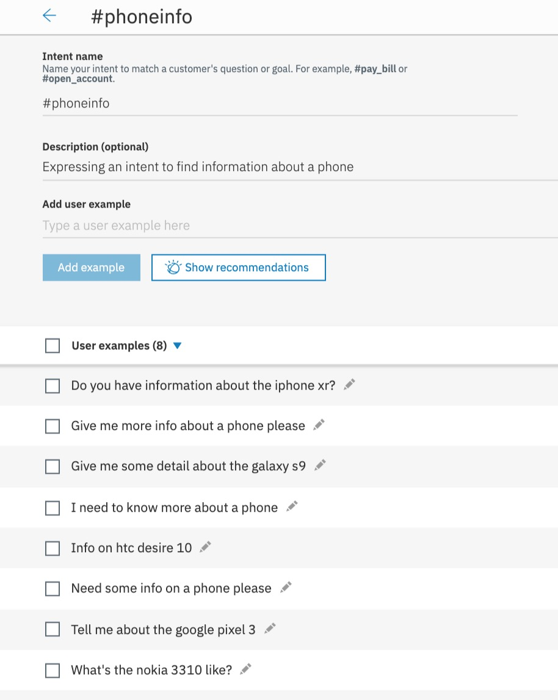

**(2)** Next we need to create an _entity_ called `@model` to capture the name of the mobile phone model we want some information about. Previously we created our _entities_ in [Lab 1: Cognitive Chatbot Basics](../1-Basics) manually, but there's another couple of ways of building entities that are useful to understand.

The first is _**contextual entities**_. We create these by annotating occurrences of the _entity_ in sample sentences to teach the service about _the context in which the entity is typically used_. In order to train a _contextual entity_, we use our _intent_ user examples, which provide readily-available sentences to annotate.

Use the cursor to highlight `iphone xr` in the
`Do you have information about the iphone xr?` user example. When you do this, _**Watson Assistant**_ _assumes you want to create a contextual entity_, and asks you for an _entity_ name to add this example to.

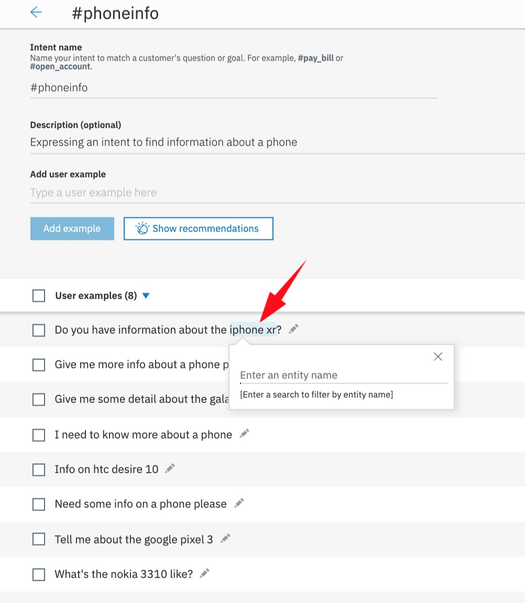

We want to add `iphone xr` to a new _entity_ called `@model`, so enter `@model` here and then select `@model (create new entity)`:

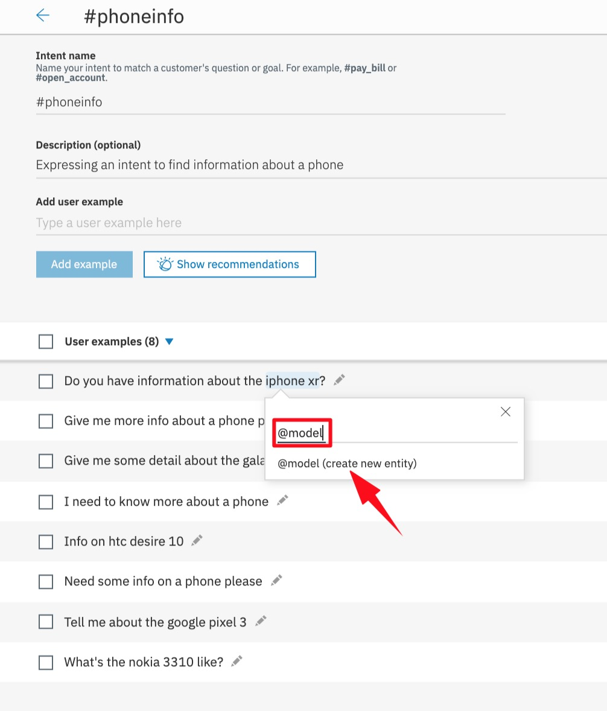

**(3)** _**Watson Assistant**_ then creates our `@model` entity - you'll see it if you go to your **Entities** list.

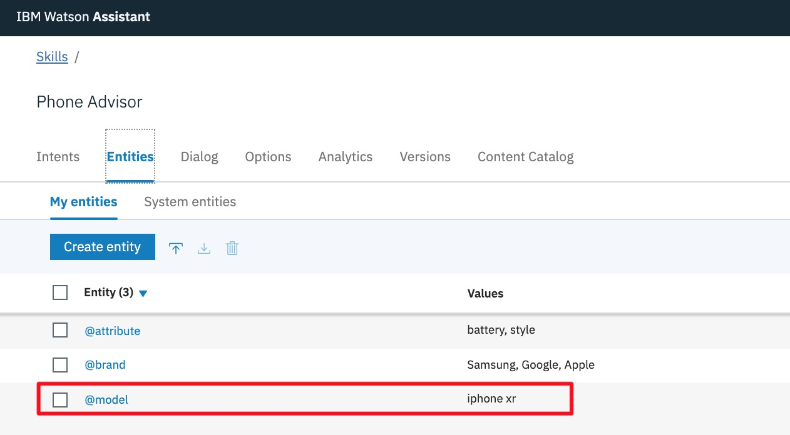

**(4)** Go back to your `#phoneinfo` _intent_ and repeat the highighting _contextual entities_ process in the user examples where you can see `galaxy s9`, `htc desire 10`, `google pixel 3` and `nokia 3310`.

When you highlight any of these now we've created our `@model` _entity_, if you then start to type in `@model` you are able to select whether you want to add the text to an existing entity, or create a new one. Add each of them to the `@model` entity.

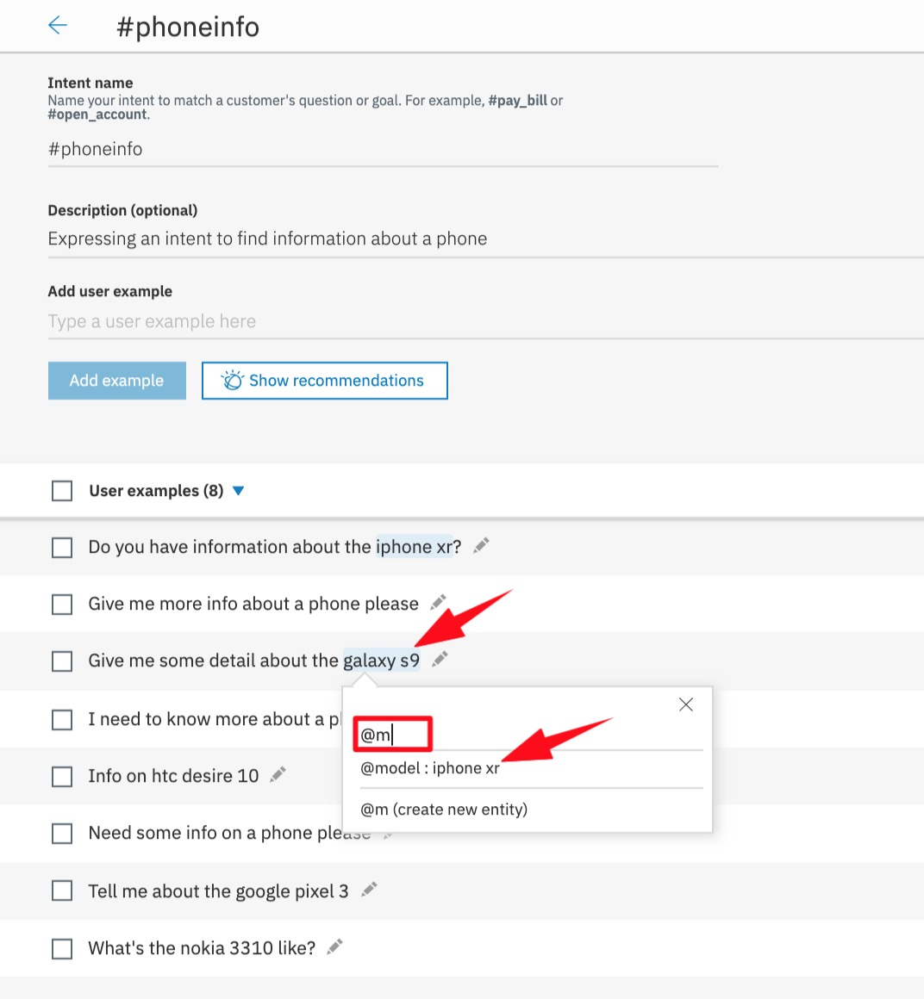

**(5)** When you've added them all, you should see them `highlighted` in the user examples within your _intent_, as well as seeing all of them as values within your `@model` _entity_.

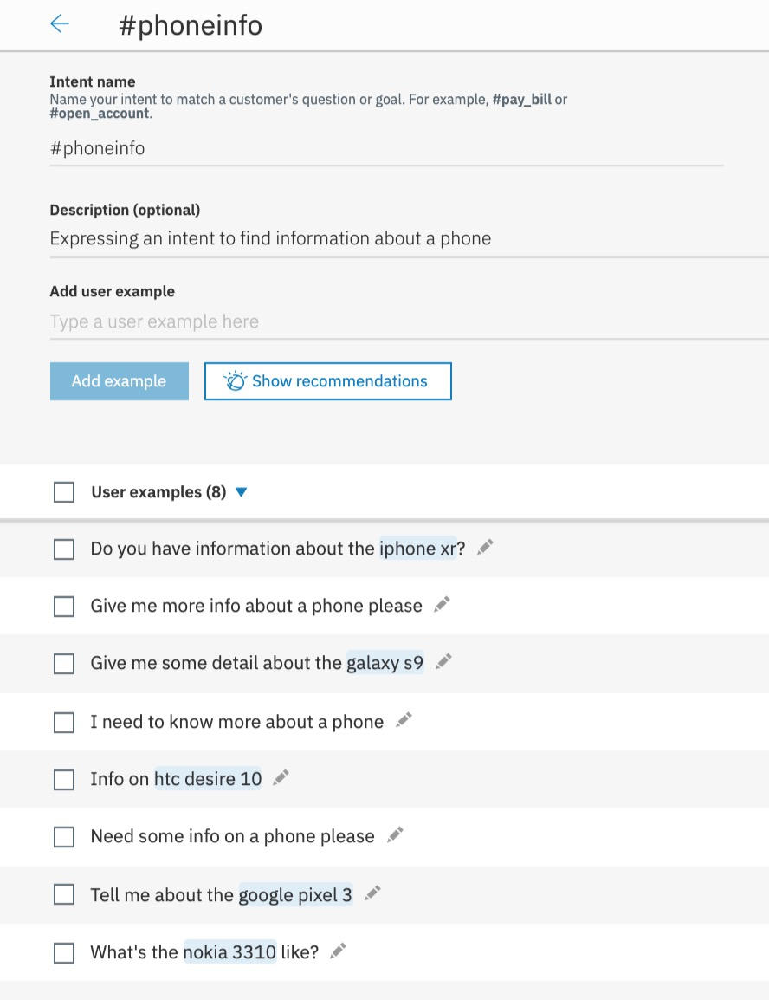

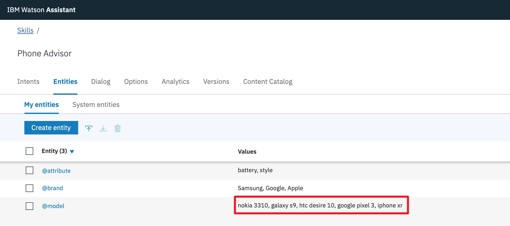

**(6)** As well as adding _entity_ values in a more user-friendly way, _**Watson Assistant**_ uses _contextual entities_ to _automatically pick up entity values_ from the way user examples are phrased in your _intent_.

If you use `Try It` with a phone model we've already added (e.g. `"tell me about htc desire 10"`), **_Watson Assistant_** picks up both the `#phoneinfo` _intent_ and the _htc desire 10_ `@model` as you would expect.

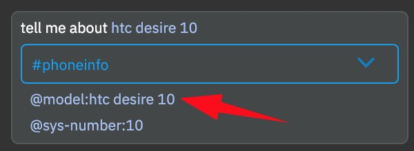

Now `Try It` with a phone model we've not yet added to our `@model `entity (e.g. `do you have any detail on the Huawei Mate 20`). **_Watson Assistant_** again picks up the `#phoneinfo` _intent_, but this time - because we've used _contextual entities_ - it also assumes that _Huawei Mate 20_ is likely to be a `@model`, even though we've not explicitly added it.

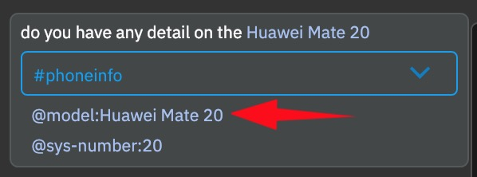

## Import entries into the `@model` entity

**(1)** As well as using _contextual entities_, we can **import** _entities_ into _**Watson Assistant**_. This is useful if we want to create a large number of values and synonyms and bulk import them, create _entities_ outside of the Watson tooling, or import entities from a previously downloaded _skill_.

The file to import should be in CSV file format, with each line containing `<entity>,<value>,<synonyms>`. Here's a sample of what we'll import to build on our existing `@model` _entity_.

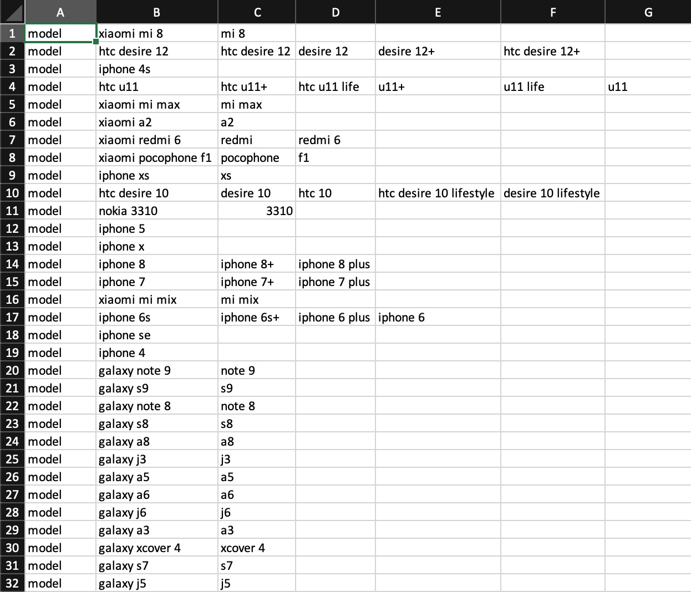

**(2)** Download this [CSV file](./assistant/model_entities.csv). In **Entities**, click on the `Import` icon, choose the file you've just downlaoded, and select `Import`.

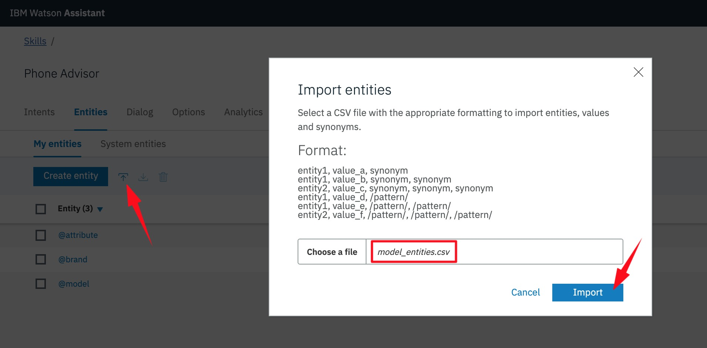

**(3)** You should see an `Import Successful` message, showing how many new _entities, values, synonyms_ and _patterns_ have been added. _**Watson Assistant**_ will also keep any values you've already created - our import has merged items from the CSV file into our existing `@model` _entity_.

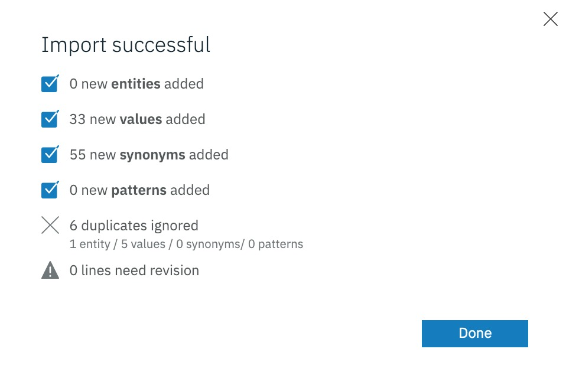

_**Watson Assistant**_ even merges new _synonyms_ into existing _entity_ values. If you remember, we created five _contextual entities_ earlier, including `galaxy s9` and `htc desire 10`, without _synonyms_. Here you can see the import has kept these values, and also successfully imported the _synonyms_ we defined for them in the CSV file.

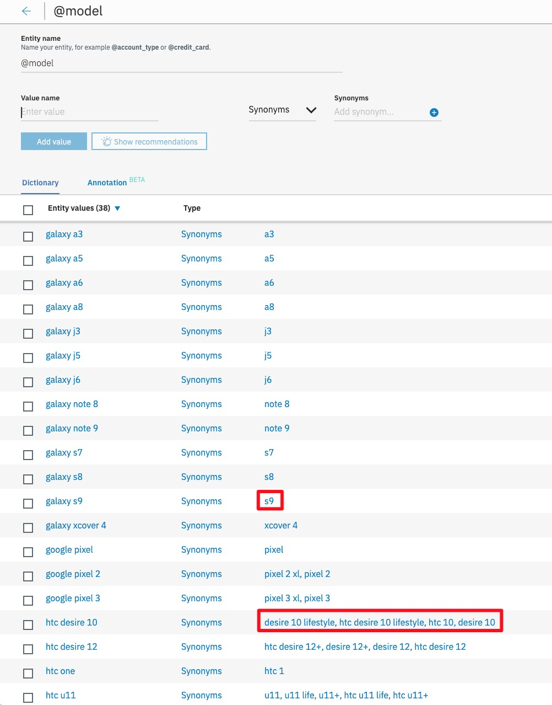

**(4)** Now, any of our _pre-defined_ or _imported_ `entities` should be picked up.

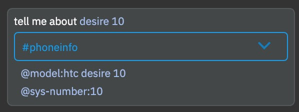

Also, _contextual entities_ will still function - even if we haven't defined a value in our entity list, _**Watson Assistant**_ will match values it thinks belong to the `@model` entity.

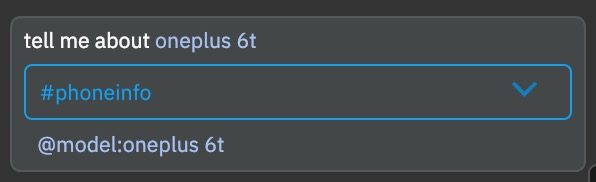

## Build `searchWikipedia` _**IBM Cloud Function**_

**(1)** Now let's build an **_IBM Cloud Function_** that will search **_Wikipedia_** and return information from that repository about a phone model. On the [Create Action page](https://cloud.ibm.com/openwhisk/create/action), enter `searchWikipediaXXX` as the **Action Name** (replacing `XXX` with your initials), select runtime `Node.js 8`, and hit `Create`.

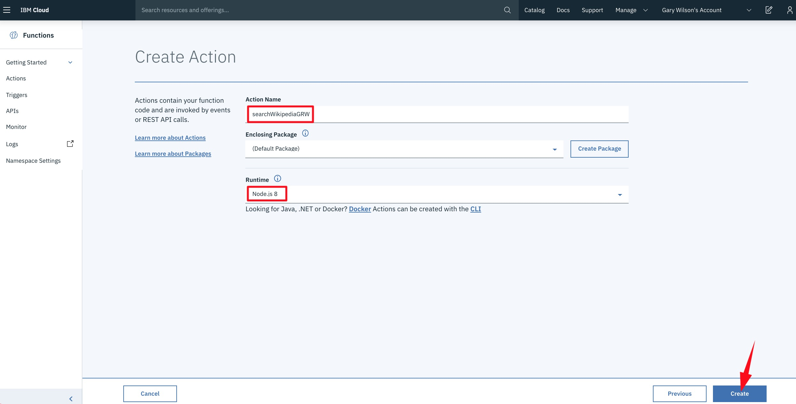

**(2)** Like our other _**IBM Cloud Functions**_, it should expect some sort of input (we'll call it _payload_ again), and return some information in a JSON object (we'll call it _article_ this time).

In order to get the required output, we need to understand the format of the _Wikipedia API calls_ we need to make. These are documented in detail at [the MediaWiki site](https://www.mediawiki.org/wiki/API:Query).

For our function, we need to make two calls. The first returns a _list of articles_ from _Wikipedia_ based on the search query (a mobile phone model in our case), and the second then extracts the _introductory text_ from the Wikipedia article for the top hit from our previous search.

**(3)** Using the [MediaWiki](https://www.mediawiki.org/wiki/API:Query) documentation, we can work out that our first call is:
```javascript
https://en.wikipedia.org/w/api.php?format=json&action=query&list=search&srwhat=text&srprop=timestamp&continue=&srsearch=<INSERT SEARCH TERM>
```
And our second one is:
```javascript
https://en.wikipedia.org/w/api.php?format=json&action=query&prop=extracts&formatversion=2&redirects=1&exintro=&explaintext=&titles=<INSERT TITLE OF TOP HIT>
```
It's always a good idea to test your API calls before building your code! If you enter the first call in a browser window using `galaxy%20s9` as the search term:
```javascript
https://en.wikipedia.org/w/api.php?format=json&action=query&list=search&srwhat=text&srprop=timestamp&continue=&srsearch=galaxy%20s9
```
you'll get a JSON object returned like this:

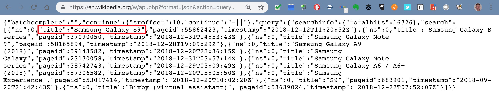

_Note: The `%20` in the search term translates to a space._

You can see that the **title** of the first hit we get is `Samsung Galaxy S9`. This is what we now plug into the **titles** variable of our second call in order to get the article **extract**.

```javascript
https://en.wikipedia.org/w/api.php?format=json&action=query&prop=extracts&formatversion=2&redirects=1&exintro=&explaintext=&titles=Samsung%20Galaxy%20S9
```
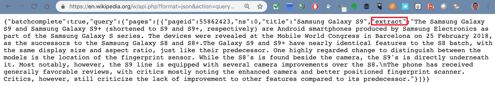

**(4)** Let's now use these calls by replacing the default code in the editor with this:
```javascript
/**
  * main() will be run when you invoke this action
  *
  * @param Accepts a text string 'payload' used for the Wikipedia query
  *
  * First function call (searchForArticles) retrieves top articles for text within 'payload'
  * Second function call (getArticleExtract) extracts introductory text from top result
  *
  * @return JSON object with:
  *         extract: introductory text from top matching article
  */
var request = require('request');

function main({payload: payload}) {

   var searchForArticles = function() {
       var url = "https://en.wikipedia.org/w/api.php?format=json&action=query&list=search&srwhat=text&srprop=timestamp&continue=&srsearch=" + payload;
       var promise = new Promise(function(resolve, reject) {
           request(
             {
               url: url,
               method: 'GET',
               headers: { "content-type": "application/json" }
             },
               function(error, response, body) {
               if (error) {              
                   reject(error);
               } else {
                   var searchOutput = JSON.parse(body);
                   resolve({title: searchOutput.query.search[0].title});
               }
              }
            );
       });
       return promise;
   };

   var getArticleExtract = function(searchOptions) {           
       var url = "https://en.wikipedia.org/w/api.php?format=json&action=query&prop=extracts&formatversion=2&redirects=1&exintro=&explaintext=&titles=" + searchOptions.title;
       var promise = new Promise(function(resolve, reject) {
           request(
             {
               url: url,
               method: 'GET',
               headers: { "content-type": "application/json" }
             },
               function(error, response, body) {
               if (error) {              
                   reject(error);
               } else {
                   var articleOutput = JSON.parse(body);
                   resolve({extract: articleOutput.query.pages[0].extract});
               }
              }
            );
       });
       return promise;
   };

   var article = searchForArticles().then(getArticleExtract);

   return article;
}
```
In this code, the `searchForArticles` function extracts the **title** of the first article returned using our first call, and passes that as input to our second call within the `getArticleExtract` function. We then return the **extract** field from the result of this call.

**(5)** Test the code works correctly by using `Change Input`, entering the test data below, and hitting `Invoke`. You should see the extracted text from the article in the **Activations** panel.
```javascript
{"payload": "galaxy s9"}
```
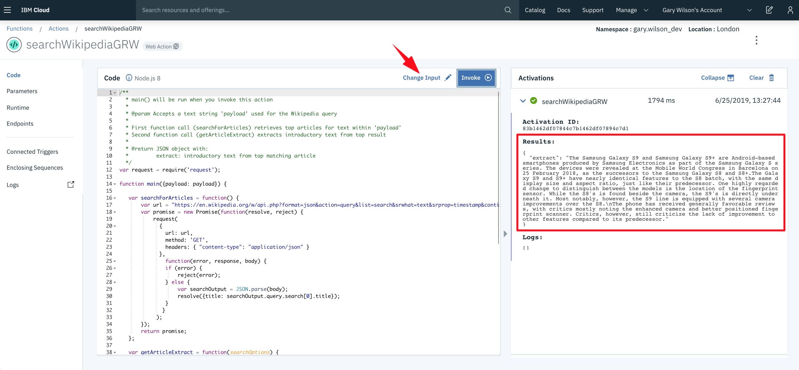

**(6)** Now go to `Endpoints` once more, tick `Enable as Web Action`, then `Save`.

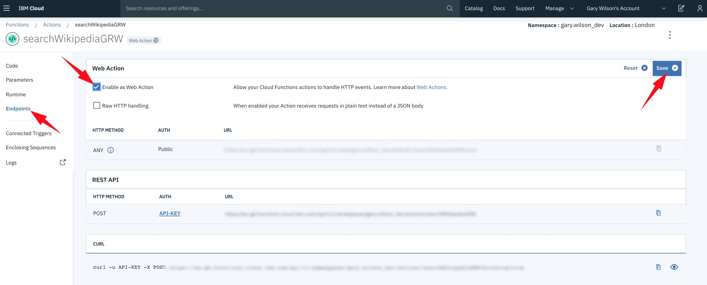

## Create `Phone Information` _dialog_
**(1)** The final step is to build a _dialog_ to use our new _intent_, _entity_ and _**IBM Cloud Function**_. Select the `Anything else: call Watson Discovery` node, and use the three dots icon to select `Add node above`. It's _really_ important that you add this new dialog node **above** here, as any nodes in the _dialog_ tree that appear after an `anything_else` test will never be evaluated.

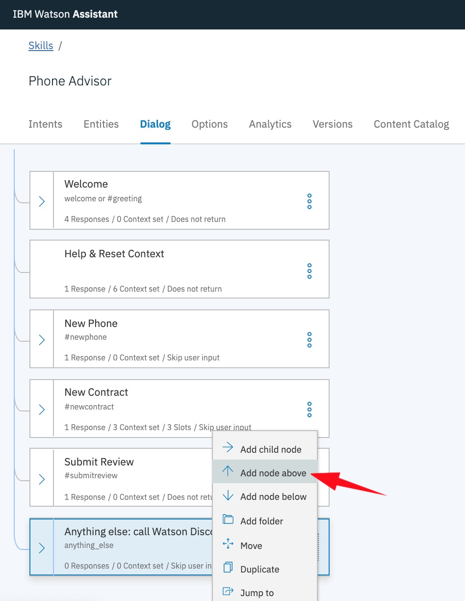

**(2)** Name the new node `Phone Information` and use `Customize` to ensure **Slots** are turned `On`. Configure the node so it fires when the `#phoneinfo` _intent_ is picked up, and it captures a `@model` in a _slot_ with a name of `$phoneModel`. If a phone model isn't immediately captured, get _**Watson Assistant**_ to ask the user `Which phone model would you like more information about?`.

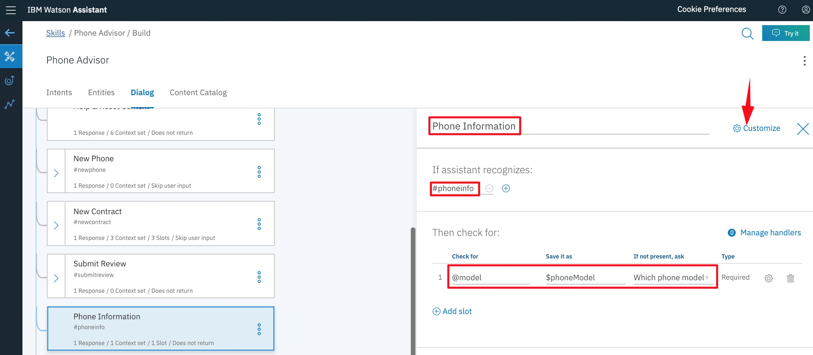

**(3)** Open the _JSON editor_ for the node, and replace the existing code with this:
```Javascript
{
  "output": {
    "generic": []
  },
  "actions": [
    {
      "name": "<my-searchWikipedia-endpoint>",
      "type": "web_action",
      "parameters": {
        "payload": "$phoneModel"
      },
      "result_variable": "$article"
    }
  ]
}
```
Replace `<my-searchWikipedia-endpoint>` with the name of your `searchWikipediaXXX` _endpoint_ - find it by going back to your _**IBM Cloud Function**_, clicking `Endpoints` from the sidebar, and copying everything in the **Web Action URL** _after_ _**.../web/**_.

It'll look something like this:
```Javascript
jerry.seinfeld_dev/default/searchWikipediaXXX.json
```
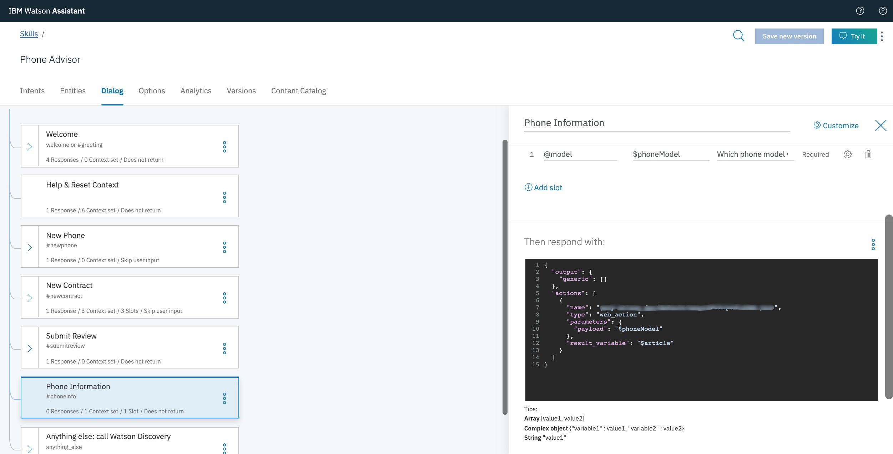

This node will then call our `searchWikipedia` function, passing `$phoneModel` as input and expecting a result in `$article`.

**(4)** Add a child node to `Phone Information` and call it `Return Wikipedia article`. Use `true` for **If assistant recognizes**, and configure the text response to the user as `$article.extract`. This will send the _Wikipedia_ article extracted back to the user. As usual, ensure we **Jump to...** `Help & Reset Context` when we drop out of this node.

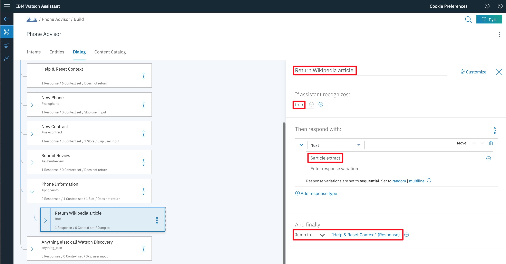

**(5)** Finally let's ensure we clean up correctly. Change the parent `Phone Information` node so that it will `Skip user input`.


And update the `Help & Reset Context` node so that it resets our new `$phoneModel` and `$article` _context variables_ to `null`.

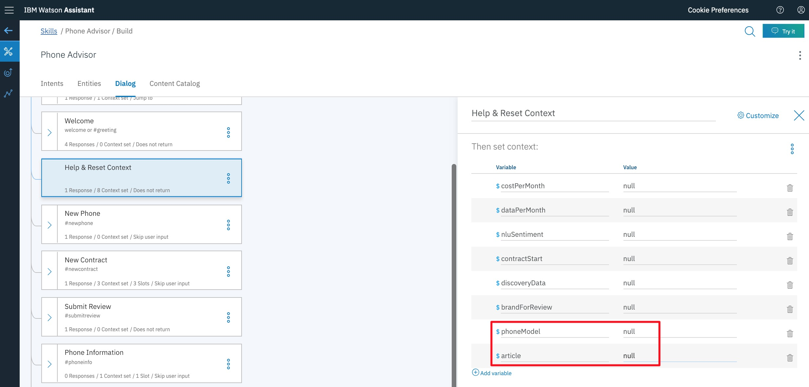

**(6)** Test your new dialog using `Try It`. It should work with _entity_ values you've _imported_ (e.g. _"iphone 8"_), and with _contextual entities_ it recognises that are not explicitly defined (e.g. _"oneplus 6t"_).

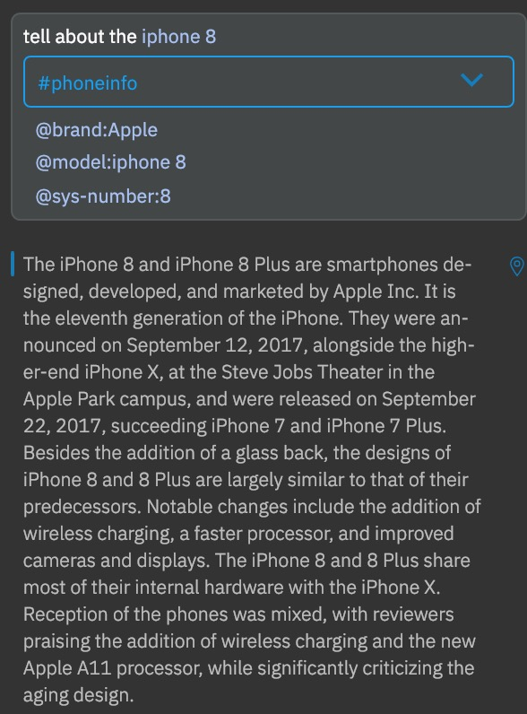

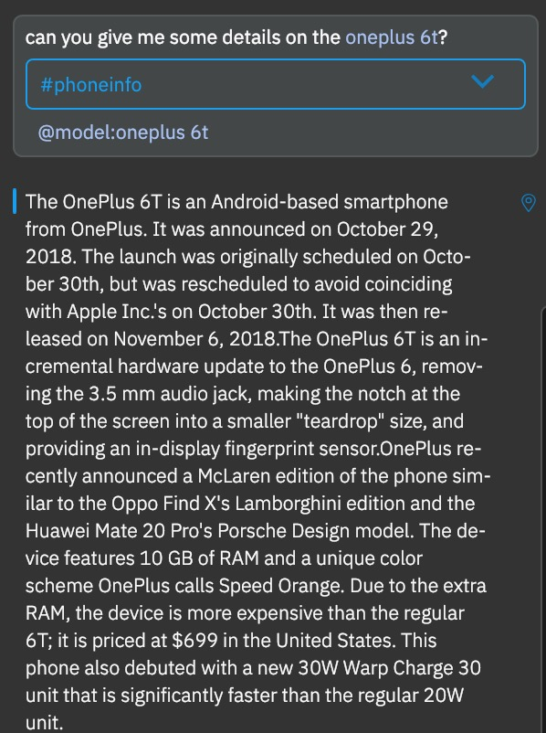

## Final Demo
Your chatbot is complete! Try following the demo script in the image below using your _**Watson Assistant**_ web test widget, the web-hosted version of your chatbot, or in _Slack_ to see it in action! It uses all of the functionality you've built, and demonstrates how they could be used together to create an intelligent user dialog.

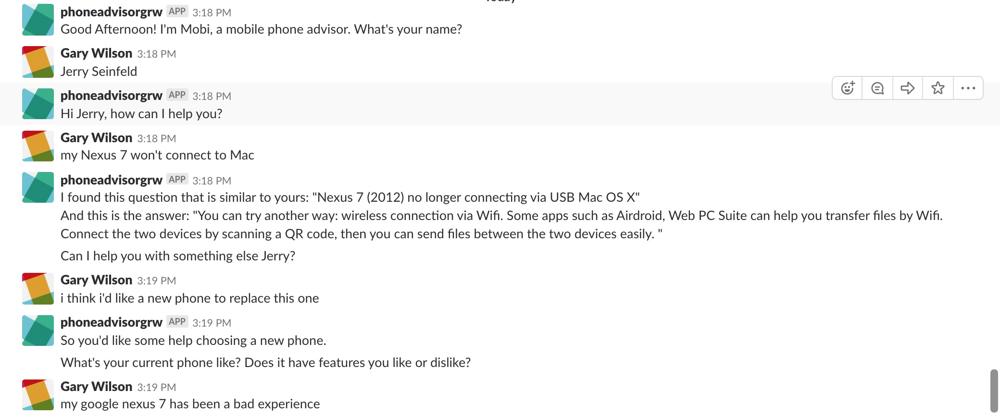
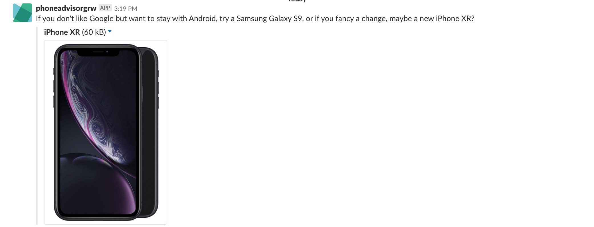

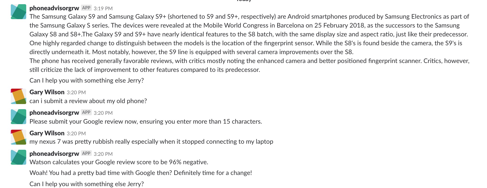
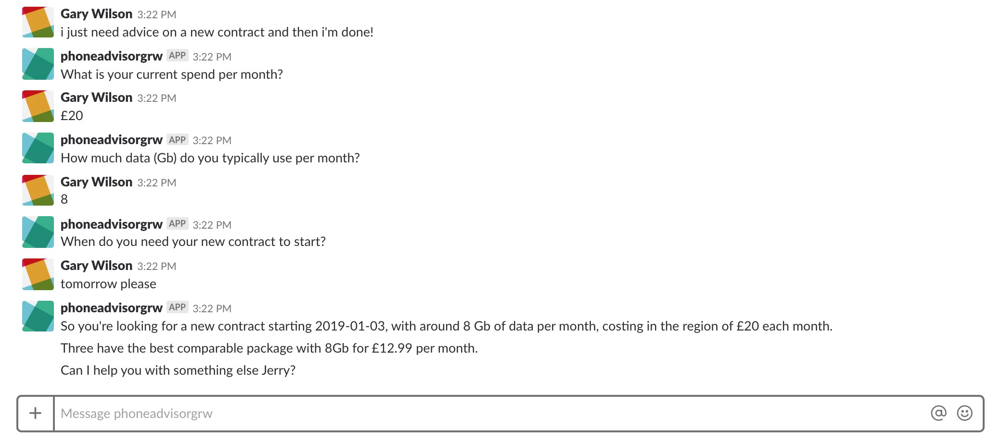

## Summary
You've reached the end of the _**Watson Assistant**_ labs! Over the course of six tutorials, you've learned how to:
- build chatbots in _**Watson Assistant**_ using _intents_, _entities_ and _dialogs_
- use _rich content_ such as images and option buttons in your chatbot
- test your chatbot from within _**Watson Assistant**_, and build web test widget and Slack _integrations_ and a publicly available web-hosted version of your chatbot
- build _dialogs_ that collect multiple pieces of information for a user using _slots_
- work with _context_ and _expressions_ in order to add more intelligence to your responses
- create and call `IBM Cloud Functions` from your chatbot that can interface with IBM Watson and other external services
- use _**Watson Natural Language Understanding**_ to understand user _sentiment_
- use _**Watson Discovery**_ to search for answers from a larger corpus of information and build long-tail responses into your chatbot
- access third party services in order to integrate information from external sources within your chatbot

If you want to download the **complete and final** _**Watson Assistant**_ _skill_ you can do so [here](./assistant/skill-Phone-Advisor-lab-6.json). Remember, if you import this version of the _skill_, you'll have to modify:
- the `Call getSentiment function` node to refer to your `getSentimentXXX` _**IBM Cloud Function**_ API details
- the `Phone Information` node to refer to your `searchWikipediaXXX` _**IBM Cloud Function API**_ details
- the `Anything else: call Watson Discovery` node to refer to your `getDiscoveryTopHitXXX` _**IBM Cloud Function API**_ details 
